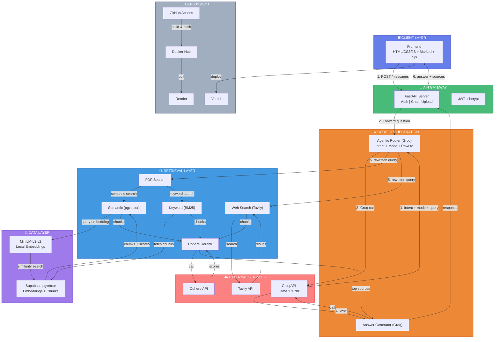

# 🧠 DualMind
 

**Agentic Hybrid RAG System | PDF & Web Search | Multi-Intent Routing**

---

## 📌 Overview

**DualMind** is an intelligent conversational AI system that combines document-based RAG with web search capabilities. Features an **agentic router** that intelligently determines query intent and selects optimal retrieval strategy.

---

## ✨ Key Features

| Feature | Description |
|---------|-------------|
| 🧠 **Agentic Intent Router** | LLM-powered router detects query intent (conversation/document/web/hybrid) and dynamically selects the optimal retrieval strategy |
| 🔀 **Multi-Intent Routing** | Routes queries to appropriate sources: PDF-only, web-only, or hybrid combination based on context |
| 📄 **PDF Processing** | Upload and process PDFs with semantic chunking (500 chars, 100 overlap) and store embeddings in pgvector |
| 🔍 **Hybrid Retrieval** | Combines semantic search (pgvector) + keyword search (BM25-style) for comprehensive document retrieval |
| 🌐 **Real-time Web Search** | Tavily API integration for live information retrieval |
| 🔗 **Cohere Reranking** | Re-ranks retrieved results for improved relevance |
| 💬 **Chat Sessions** | Persistent conversation history with auto-naming |
| 🎨 **Modern UI** | Dark theme, responsive design, chat-like interface with code syntax highlighting |
| 🔐 **JWT Authentication** | Secure authentication with bcrypt password hashing and email verification (OTP) |
| 🐳 **Containerized** | Dockerized backend for consistent deployment |
| ⚙️ **CI/CD Pipeline** | GitHub Actions automates testing, Docker build, and deployment to Render |

---

## 🏗️ Architecture

## 🧩 Tech Stack

### Backend
| Technology | Purpose |
|------------|---------|
| **FastAPI** | Async web framework |
| **Groq API** | LLM inference (Llama 3.3 70B) |
| **Tavily API** | Web search |
| **Cohere API** | Result reranking |
| **Supabase** | PostgreSQL + Auth |
| **SentenceTransformers** | Local embeddings (paraphrase-MiniLM-L3-v2) |
| **PyPDF** | PDF text extraction |
| **JWT** | Authentication |

### Frontend
| Technology | Purpose |
|------------|---------|
| **HTML5/CSS3** | UI structure & styling |
| **Vanilla JS** | Core logic |
| **Marked.js** | Markdown rendering |
| **Highlight.js** | Code syntax highlighting |
| **Font Awesome** | Icons |

### DevOps
| Tool | Purpose |
|------|---------|
| **Docker** | Containerization |
| **GitHub Actions** | CI/CD Pipeline |
| **Render** | Backend hosting |
| **Vercel** | Frontend hosting |

---

## 🚦 CI/CD Pipeline

Push to main → Run Tests → Build Docker → Push to Registry → Deploy to Render → Deploy to Vercel

GitHub Actions Jobs:

1.Test - Runs pytest with coverage

2.Build & Push - Docker image to Docker Hub

3.Deploy Backend - Trigger Render 
