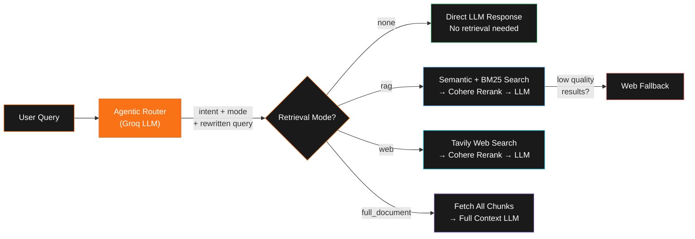
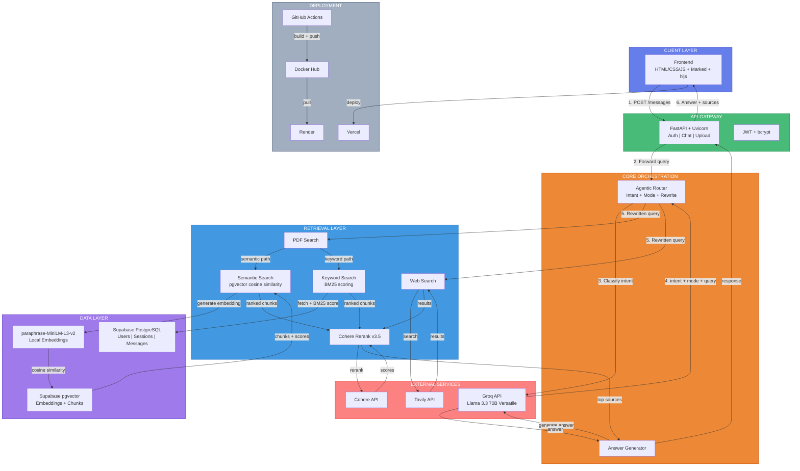
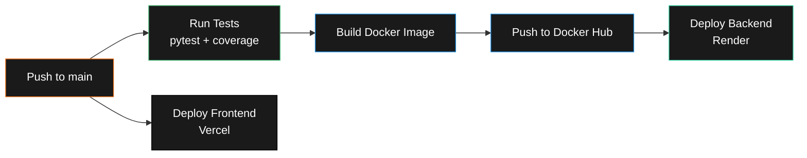

<div align="center">


# DualMind

**Agentic Hybrid RAG System — PDF & Web Search — Multi-Intent Routing**

An intelligent conversational AI that combines document-based retrieval with real-time web search,<br/>
powered by an LLM-driven agentic router that autonomously classifies intent and selects retrieval strategy.

<br/>

[](https://python.org)
[](https://fastapi.tiangolo.com)
[](https://groq.com)
[](https://supabase.com)
[](https://cohere.com)
[](https://tavily.com)
[](https://docker.com)
[](https://github.com/features/actions)
[](https://render.com)
[](https://vercel.com)
[](LICENSE)

</div>

<br/>

---
## Demo Video

<p align="center">
  <video src="assets/dualmind-demo.mp4" controls width="100%" preload="metadata"></video>
</p>


## 

<table>
<tr>
<td width="50%">

<br/>
LLM-powered intent classification across 10 intent types — autonomously decides <em>how</em> to answer every query

<br/>
Upload PDFs and query them with hybrid semantic + BM25 keyword retrieval

<br/>
Real-time web search via Tavily API with automatic fallback when documents lack answers

<br/>
Cross-encoder reranking (rerank-v3.5) for precision-optimized source selection

</td>
<td width="50%">

<br/>
Combines PDF search + web search with intelligent fallback — the system decides the optimal strategy

<br/>
Persistent conversation history with session management, renaming, and context-aware follow-ups

<br/>
Secure user accounts with bcrypt password hashing and JWT token-based auth

<br/>
Containerized deployment with automated GitHub Actions pipeline — test, build, deploy

</td>
</tr>
</table>

<br/>

---

<br/>

## 

DualMind's standout feature is its **agentic router** — a single Groq LLM call that autonomously decides three things for every user query:

| Decision | What it determines | Example |
|---|---|---|
| **Intent** | What the user wants (1 of 10 types) | `FACTUAL_LOOKUP`, `SUMMARIZE`, `CODE_REQUEST` |
| **Retrieval Mode** | Where to get information | `rag`, `web`, `full_document`, `none` |
| **Query Rewrite** | Optimized search query | "tell me about chapter 3" → "chapter 3 key concepts" |

<br/>

### Intent Classification

The router classifies every query into exactly one of these intents:

```
 FACTUAL_LOOKUP               Specific questions about documents or general knowledge
 FACTUAL_LOOKUP_WEB_FALLBACK  Document lookup with automatic web fallback if PDF lacks answers
 SUMMARIZE                    "What's this?", "explain", "overview" — vague document queries
 GENERATE_NOTES               "Make notes", "bullet points", "key takeaways"
 COMPARE                      "Compare X vs Y", "difference between"
 CODE_REQUEST                 Write, fix, explain, or improve code
 WEB_SEARCH                   Needs live data — news, prices, weather, current events
 CASUAL_CHAT                  Greetings, thanks, opinions, general conversation
 CONVERSATION_RECALL          "What did we discuss?", "earlier you said"
 META_QUESTION                "What can you do?", "what formats do you support?"
```

<br/>

### Routing Decision Flow



> The router includes a **regex-based fallback** — if the Groq API call fails, pattern matching ensures the system still routes correctly.

<br/>

---

<br/>

## 



<br/>

---

<br/>

## 

### Backend

| Technology | Purpose |
|---|---|
| **FastAPI + Uvicorn** | Async web framework + ASGI server |
| **Groq API** | LLM inference (Llama 3.3 70B Versatile) |
| **Supabase PostgreSQL** | Relational database — users, sessions, messages |
| **Supabase pgvector** | Vector database — semantic similarity search |
| **SentenceTransformers** | Local embedding model (paraphrase-MiniLM-L3-v2) |
| **BM25 (Custom)** | Keyword-based lexical retrieval with IDF scoring |
| **Cohere API** | Cross-encoder result reranking (rerank-v3.5) |
| **Tavily API** | Real-time web search |
| **PyPDF** | PDF text extraction and chunking |
| **JWT + bcrypt** | Token authentication + password hashing |
| **Pydantic** | Request/response schema validation |

### Frontend

| Technology | Purpose |
|---|---|
| **HTML5 / CSS3** | UI structure and styling |
| **Vanilla JavaScript** | Core application logic |
| **Marked.js** | Markdown rendering |
| **Highlight.js** | Code syntax highlighting |
| **Font Awesome** | UI icons |
| **DM Sans + JetBrains Mono** | Typography (Google Fonts) |

### DevOps

| Tool | Purpose |
|---|---|
| **Docker** | Containerization |
| **GitHub Actions** | CI/CD — test, build, push, deploy |
| **Docker Hub** | Container registry |
| **Render** | Backend hosting |
| **Vercel** | Frontend hosting |

<br/>

---

<br/>

## 

### Prerequisites

- Python 3.11+
- Docker (optional, for containerized deployment)
- API keys: [Groq](https://console.groq.com), [Tavily](https://tavily.com), [Cohere](https://dashboard.cohere.com), [Supabase](https://supabase.com)

### 1. Clone the repository

```bash
git clone https://github.com/ajayraj30002/DualMind.git
cd DualMind
```

### 2. Set up environment variables

Create a `.env` file in the `backend/` directory (see [`backend/.env.example`](backend/.env.example)):

```env
# LLM
GROQ_API_KEY=your_groq_api_key

# Search
TAVILY_API_KEY=your_tavily_api_key

# Reranking
COHERE_API_KEY=your_cohere_api_key

# Database (Supabase)
SUPABASE_URL=https://your-project.supabase.co
SUPABASE_ANON_KEY=your_supabase_anon_key
SUPABASE_JWT_SECRET=your_supabase_jwt_secret

# Authentication
JWT_SECRET_KEY=your_jwt_secret_key
JWT_ALGORITHM=HS256
JWT_EXPIRY_MINUTES=60

# CORS
ALLOWED_ORIGINS=http://localhost:3000,http://localhost:5500
```

### 3. Supabase setup

Enable the **pgvector** extension in your Supabase project and create the required tables:

```sql
-- Enable vector extension
CREATE EXTENSION IF NOT EXISTS vector;

-- Users table
CREATE TABLE users (
    id UUID DEFAULT gen_random_uuid() PRIMARY KEY,
    email TEXT UNIQUE NOT NULL,
    hashed_password TEXT NOT NULL,
    full_name TEXT,
    created_at TIMESTAMPTZ DEFAULT now()
);

-- Document chunks with vector embeddings
CREATE TABLE document_chunks (
    id UUID DEFAULT gen_random_uuid() PRIMARY KEY,
    user_id UUID REFERENCES users(id),
    filename TEXT NOT NULL,
    chunk_text TEXT NOT NULL,
    chunk_index INTEGER,
    embedding VECTOR(384)
);

-- Vector similarity search function
CREATE OR REPLACE FUNCTION match_documents(
    query_embedding VECTOR(384),
    match_user_id UUID,
    match_count INT DEFAULT 5
) RETURNS TABLE (
    chunk_text TEXT,
    filename TEXT,
    chunk_index INT,
    similarity FLOAT
) AS $$
    SELECT chunk_text, filename, chunk_index,
           1 - (embedding <=> query_embedding) AS similarity
    FROM document_chunks
    WHERE user_id = match_user_id
    ORDER BY embedding <=> query_embedding
    LIMIT match_count;
$$ LANGUAGE sql;
```

### 4a. Run with Docker

```bash
cd backend
docker-compose up --build
```

### 4b. Run without Docker

```bash
cd backend
pip install -r requirements.txt
uvicorn app.main:app --host 0.0.0.0 --port 8000 --reload
```

### 5. Open the frontend

Open `frontend/index.html` in your browser, or serve it with any static file server:

```bash
cd frontend
python -m http.server 5500
```

<br/>

---

<br/>

## 

```
DualMind/
├── backend/
│   ├── app/
│   │   ├── main.py                  # FastAPI application — all REST endpoints
│   │   ├── config.py                # Environment variables and settings
│   │   ├── auth.py                  # JWT token creation and verification
│   │   ├── vector_store.py          # Embeddings, semantic search, BM25, PDF processing
│   │   ├── models/
│   │   │   └── schemas.py           # Pydantic request/response models
│   │   └── rag/
│   │       ├── hybrid.py            # Agentic router + RAG pipeline + answer generation
│   │       ├── closed_domain.py     # PDF document search interface
│   │       ├── open_domain.py       # Tavily web search interface
│   │       └── response_formatter.py # Smart response formatting and source attribution
│   ├── tests/
│   │   ├── test_main.py             # API endpoint tests
│   │   └── test_hybrid_routing.py   # Agentic router unit tests
│   ├── Dockerfile
│   ├── docker-compose.yaml
│   └── requirements.txt
├── frontend/
│   ├── index.html                   # Complete UI — login, chat, sidebar, document management
│   ├── script.js                    # Client logic — auth, sessions, messaging, file upload
│   └── styles.css                   # Styling
├── .github/
│   └── workflows/
│       └── deploy.yaml              # CI/CD — test → build → push → deploy
└── assets/
    └── dualmind_logo.png
```

<br/>

---

<br/>

## 



| Job | Trigger | What it does |
|---|---|---|
| **Test** | Every push & PR | Runs `pytest` with coverage report |
| **Build & Push** | Push to `main` | Builds Docker image, pushes to Docker Hub |
| **Deploy Backend** | After build | Triggers Render deployment, verifies health check |
| **Deploy Frontend** | Push to `main` | Automatic Vercel deployment |

<br/>

---

<br/>

## 

This project is licensed under the MIT License — see the [LICENSE](LICENSE) file for details.

<br/>

---

<div align="center">


**Built with intent-driven intelligence**

</div>
